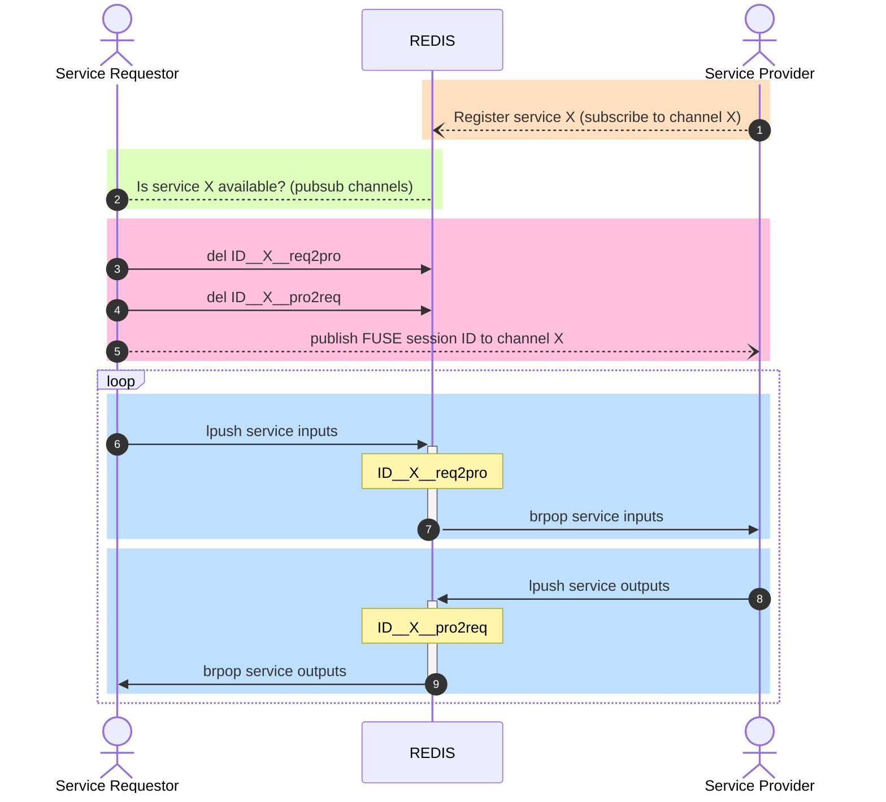

# FuseExchangeProtocoleExchangeProtocol.jl

FUSE eXchange Protocol defines the handshake for processes interfacing with FUSE, for example for co-simulation purposes with a controller.

## FuseExchangeProtocol builds on top of REDIS
* High Performance (operates in-memory) <1ms latency when run locally
* Support large data volumes (<512 MB per message)
* Distributed (ie. not geo-located)
* Versatility of data structures (lists, queues, streams, timeseries,...) with atomic operations
* Pub/Sub System
* Synchronous / Asynchronous communication patterns
* Supports multiple producers / consumers pattern
* Horizontal and vertical scalability
* Multi-language client libraries and open protocol
* Used by Twitter, GitHub, Snapchat, Airbnb, Netflix
* In comparison to other tools:
   * Unlike Memcached, REDIS supports a wider range of data structures and persistence.
   * While Kafka and RabbitMQ are more focused on message queuing and streaming, REDIS offers these capabilities along with its role as a data store and cache.
    * Compared to database services like DynamoDB, REDIS can serve as a more immediate, low-latency layer for data access and manipulation.
    * Unlike Hazelcast and etcd, which are more focused on distributed computing and configuration management respectively, REDIS offers a more general-purpose approach with its data structure support and performance.

## Online documentation
For more details, see the [online documentation](https://projecttorreypines.github.io/FuseExchangeProtocol.jl/dev).

